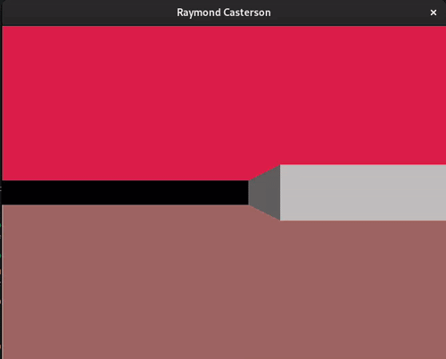

# Raymond Casterson
An experimentation in [raycasting](https://en.wikipedia.org/wiki/Ray_casting#Ray_casting_in_early_computer_games) and Clojure programming language

Formula derivations are based on notorious [Lodev Raycasting](https://lodev.org/cgtutor/raycasting.html) tutorial.

## Run with
```shell
lein run 
```

## Screenshot

